# Configuração de Servidor Web com Monitoramento

## 📌 Objetivo
Este projeto tem como objetivo configurar um servidor web na AWS e implementar um sistema de monitoramento que verifica a disponibilidade do site. Caso o servidor fique indisponível, o sistema enviará uma notificação via Discord.

## 🛠 Etapas de Configuração

## 1️⃣ Configuração do Ambiente
### 1. Criar uma **VPC** com:
   - 2 sub-redes públicas
   - 2 sub-redes privadas
   - Internet Gateway para conexão externa
   * ### Entre no console AWS e procure por VPC na busca.
   * ### Clique em "Create VPC".
      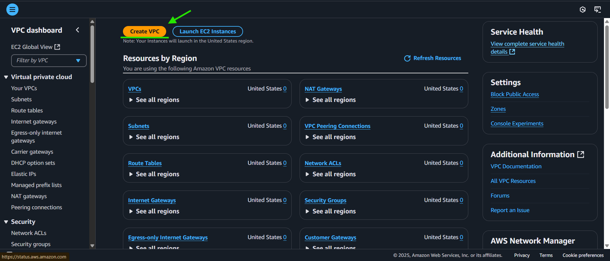
   * ### Configurando a VPC.
      | Adicione estas configurações para criar a VPC, as sub-redes e o Internet Gateway todos de uma vez. | Depois clique em "Create VPC". |
      |----------|----------|
      | 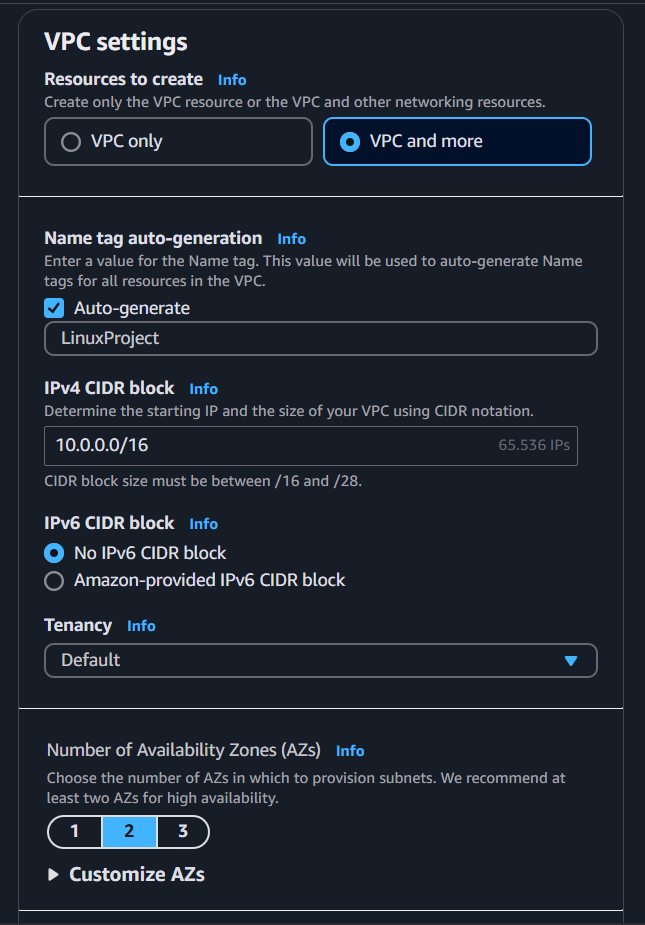 | 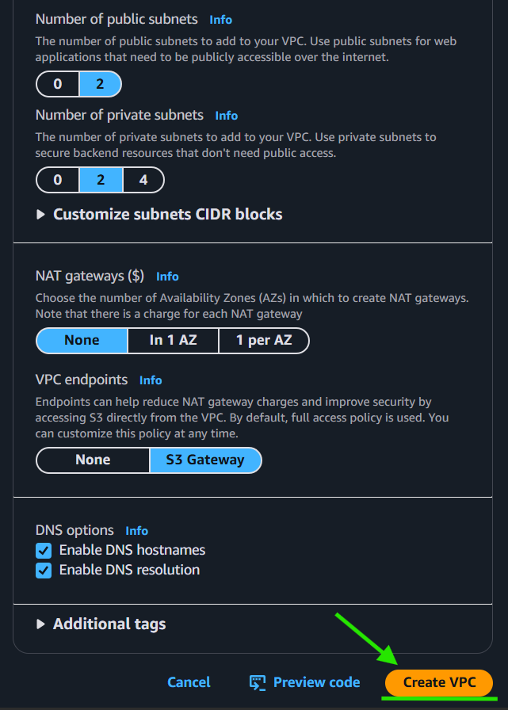 |
### 2. Editar o **Security group**:
   * ### No menu da esquerda, selecione "Security groups".
      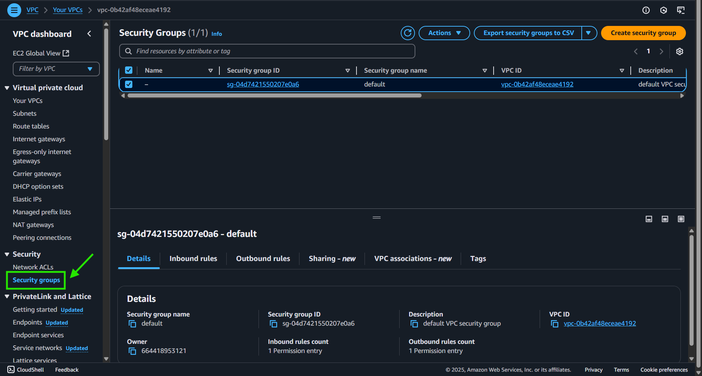
   * ### No security group já existente, adicione as regras de entrada clicando com o botão direito do mouse e selecionando a opção: "Edit inbound rules".
      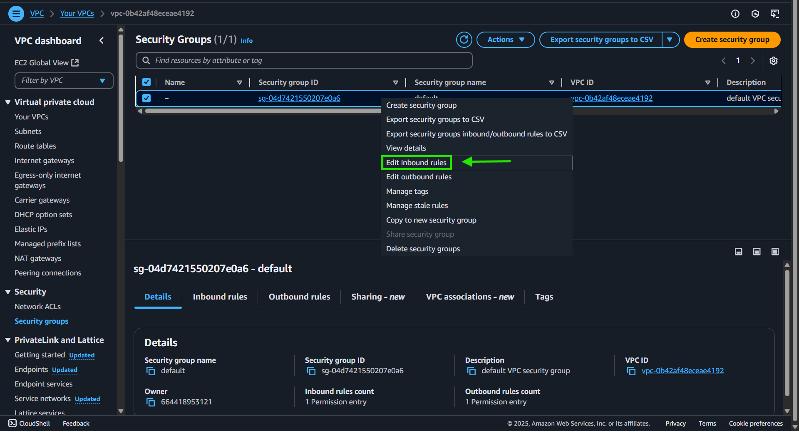
   * ### Primeiro remova a regra já existente, clicando em "Delete" , depois clique em "Add rule" no canto inferior esquerdo e adicioce a regra de SSH com seu IP (que aparecerá automáticamente), e então adicione outra regra como HTTP e salve tudo clicando em "Save rules" no canto inferior direito.
      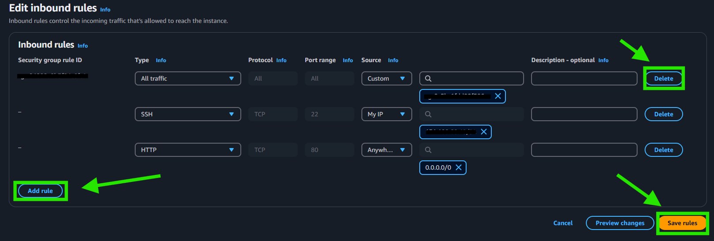
   * ### Novamente clique o com o botão direito do mouse no security group, e dessa vez selecione "Edit outbound rules" para editar as regras de saída.
      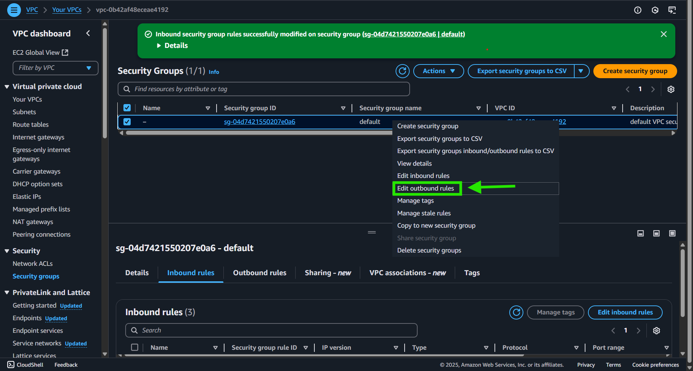
   * ### Remova a regra existente, adicione estas duas (como na imagem) e salve tudo.
      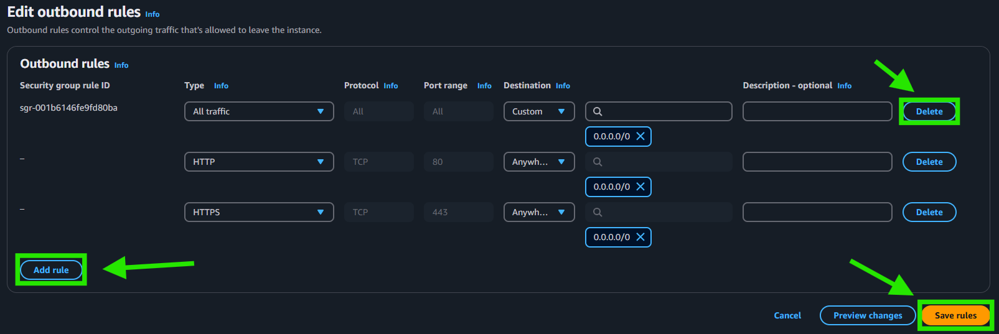
### 3. Criar uma **instância EC2** na AWS:
   * ### Na página inicial do console AWS, pesquise por "EC2".
   * ### No menu lateral selecione "Instances" e depois clique em "Launch instances" no canto superior direito.
      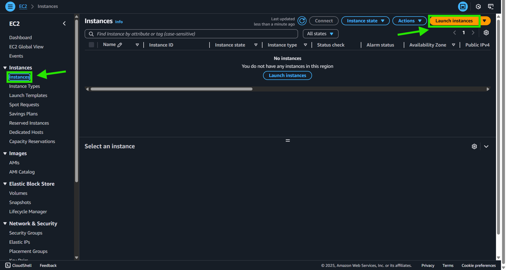
   * ### Adicione as tags necessárias em "Add additional tags" e abaixo selecione o sistema operacional "Amazon Linux".
      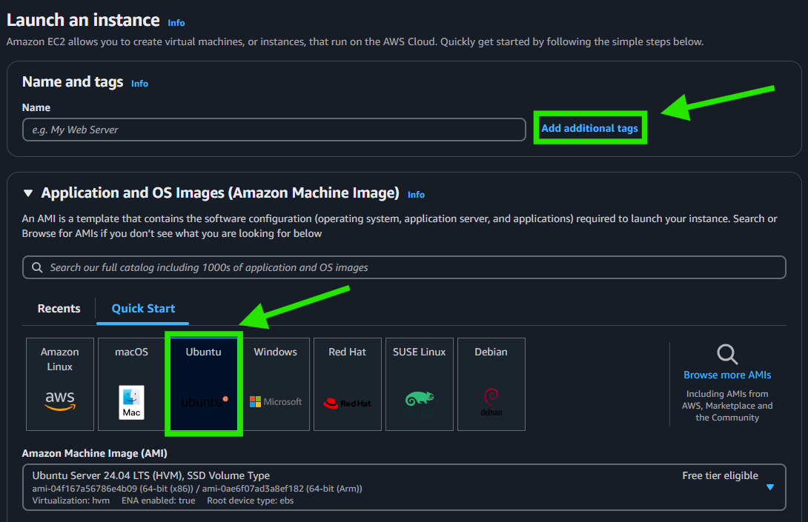
   * ### Logo abaixo, em "Key pair", clique em "create new key pair", para criar um novo par de chaves.
      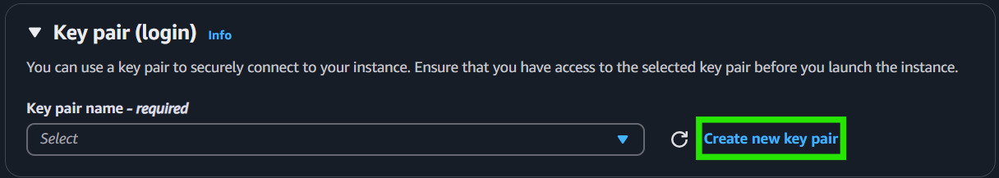
   * ### Crie um par de chaver com as seguintes configurações (como na imagem) e salve.
      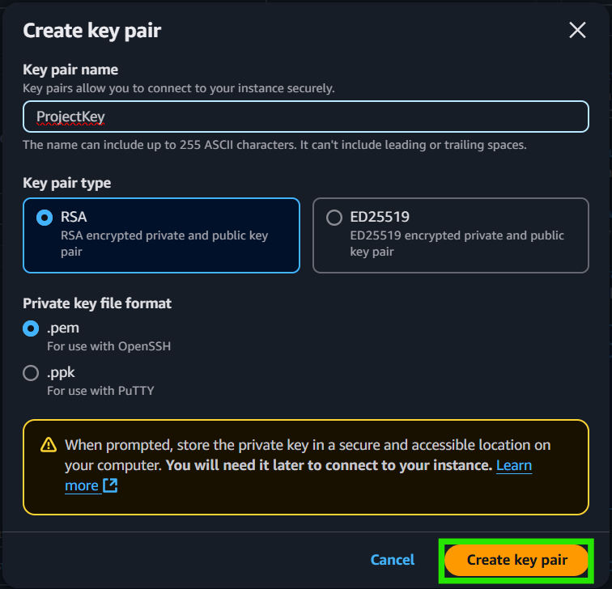
      Observe que iniciará o download da chave em seu computador.
   * ### Em seguida, clique em "Edit" no canto superior direito da seção "Network settings".
   * ### Selecione a VPC préviamente criada, selecione uma sub-net pública, selecione a opção "Enable" em "Auto-assign public IP" e escolha o security group já criado.
      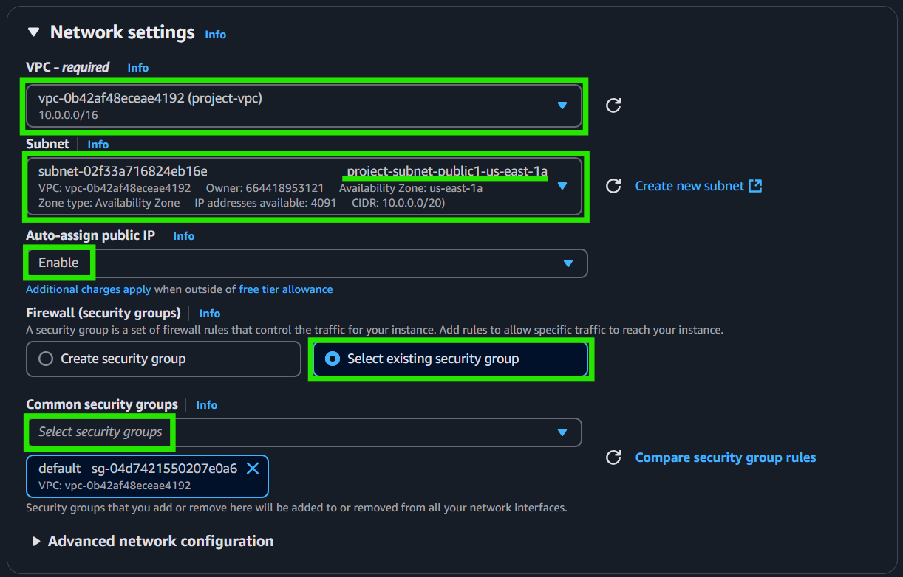
   * ### Para finalizar, clique em "Launch instance" no canto inferior direito.
      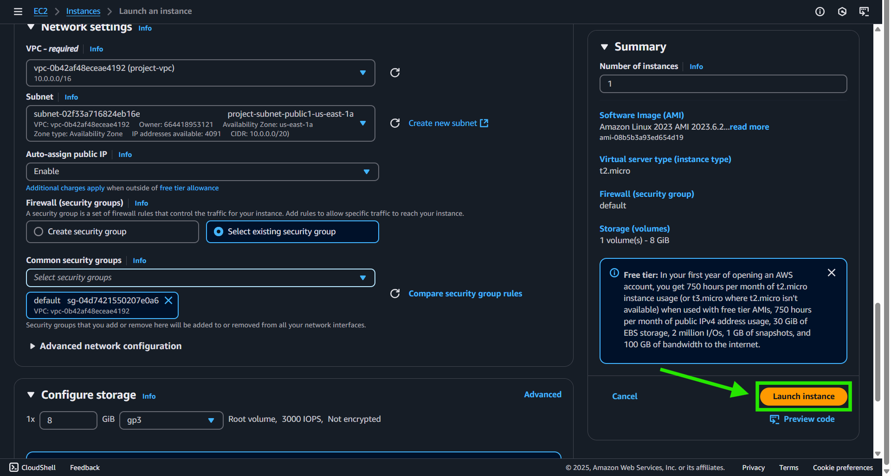
### 4. Acessar a instância via **SSH** para continuar a configuração
   * 1. Se estiver usando WSL, sua chave se encontrará neste caminho:
      ```bash
      mnt/c/Users/seuUserWindows/Downloads
      ```
   * 2. Mude as permissões da nova chave com este comando:
      ```bash
      sudo chmod 400 mnt/c/Users/seuUserWindows/Downloads/suaChave.pem
      ```
   * 3. Inicialize o sistema:
      ```bash
      ssh -i /mnt/c/Users/seuUserWindows/Downloads/suaChave.pem ubuntu@IP_publico_instancia
      ```
## 2️⃣ Configuração do Servidor Web
   * 1. Instalar o **Nginx** na EC2:
      ```bash
      sudo apt update -y
      sudo apt install nginx -y
      ```
   * 2. Iniciar o serviço Nginx:
      ```bash
      sudo systemctl start nginx
      ```
   * 3. Habilitar para iniciar com o sistema:
      ```bash
      sudo systemctl enable nginx
      ```
   * 4. Criar uma página HTML com `sudo nano /var/www/html/index.nginx-debian.html`:
      ```html
      <html>
      <head>
         <meta charset="UTF-8">
         <title>Meu Servidor Web</title>
      </head>
      <body>
         <h1>Servidor Web em Execução</h1>
      </body>
      </html>
      ```
   * 5. Reiniciar o Nginx para aplicar as mudanças:
      ```bash
      sudo systemctl restart nginx
      ```
   * 6. Verificar se a página está acessível via navegador utilizando o **IP público** da EC2 desta forma:
      ```bash
      http://SEU_IP_PUBLICO
      ```

## 3️⃣ Script de Monitoramento + Webhook
   ### 1. Como Obter a URL do Webhook no Discord:

   * 1. No Discord, crie um servidor ou escolha um existente.

   * 2. Vá até as Configurações do Servidor ou de algum canal e clique em "Integrações".
      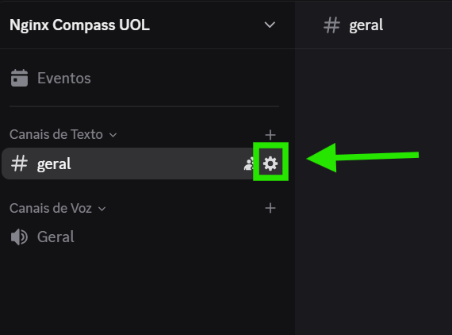 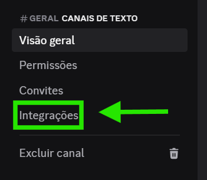

   * 3. Clique em "Criar Webhook".
      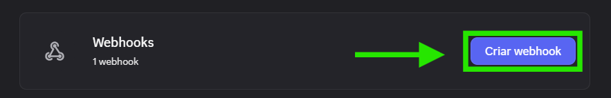

   * 4. Dê um nome ao seu Webhook e então clique em "Copiar URL do Webhook"
      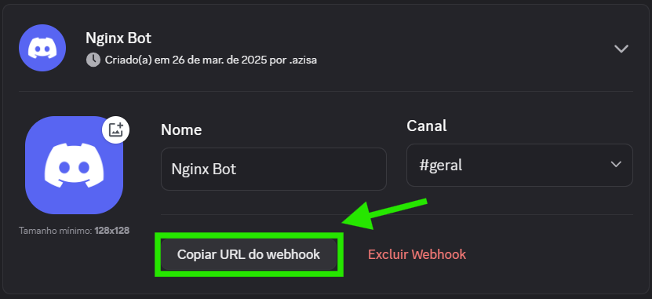

   ### 2. Criar um script Bash para verificar se o servidor está online com ```sudo nano /usr/local/bin/monitor_website.sh```:
   ```bash
   #!/bin/bash

   URL="http://IP_PUBLICO_DA_INSTANCIA"
   DISCORD_WEBHOOK_URL="URL_DO_SEU_WEBHOOK"
   LOG_FILE="/var/log/meu_script.log"

   touch "$LOG_FILE"

   send_discord_message() {
      MESSAGE="🚨 **ALERTA:** O site $URL está fora do ar!"
      curl -s -o /dev/null -H "Content-Type: application/json" \
            -X POST \
            -d "{\"content\": \"$MESSAGE\"}" \
            "$DISCORD_WEBHOOK_URL"
   }

   STATUS=$(curl -s -o /dev/null -w "%{http_code}" "$URL" || echo "000")

   if [[ "$STATUS" -ne 200 || "$STATUS" -eq 000 ]]; then
      echo "$(date) - 🚨 SITE FORA DO AR!" >> "$LOG_FILE"
      send_discord_message
   else
      echo "$(date) - ✅ Site funcionando normalmente." >> "$LOG_FILE"
   fi
   ```
   Substitua *"URL_DO_SEU_WEBHOOK"* no script pelo link copiado do discord.  
   Substitua *"IP_PUBLICO_DA_INSTANCIA"* no script pelo IP público da EC2.
   
2. Tornar o script executável:
   ```bash
   sudo chmod +x /usr/local/bin/monitor_website.sh
   ```
3. Execute o arquivo para ver se funciona:
   ```bash
   sudo /usr/local/bin/monitor_website.sh
   ```
4. Adicionar o script ao **crontab** para rodar a cada 1 minuto e escrever no arquivo de log:
   ```bash
   crontab -e
   ```
   Adicionar a linha:
   ```
   * * * * * /usr/local/bin/monitor_website.sh  >> /var/log/meu_script.log 2>&1
   ```
   Reiniciar:
   ```bash
   sudo systemctl restart cron
   ```
   Conceder as permissões corretas ao arquivo de log:
   ```bash
   sudo chmod 666 /var/log/meu_script.log
   ```

### 4️⃣ Testes
1. Acessar o site via navegador para garantir que está funcionando
2. Parar o serviço Nginx:
   ```bash
   sudo systemctl stop nginx
   ```
3. Verificar se a notificação foi enviada para o Discord
4. Reiniciar o Nginx:
   ```bash
   sudo systenctl start nginx
   ```
5. Confirmar que novas mensagens são geradas corretamente no log, usando:
   ```bash
   cat /var/log/meu_script.log
   ```

---

✅ **Projeto finalizado e pronto para uso!**